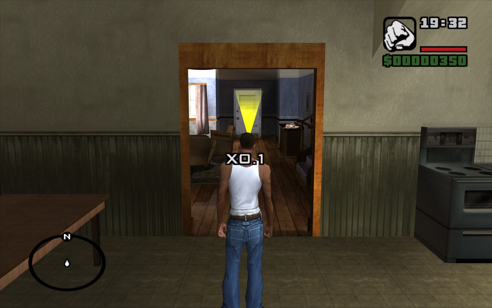
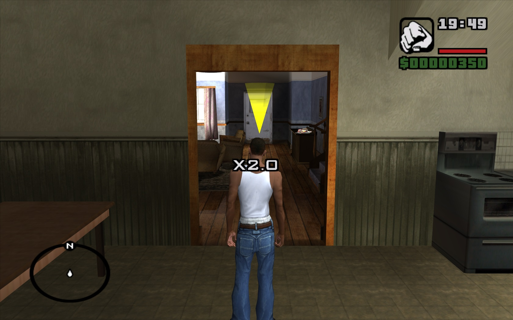

# game_speed_control
CLEO script for GTA San Andreas to control game speed.

## Installation
1. Download archive from [here](https://github.com/SalavatD/game_speed_control/releases/latest).
2. Extract `*.cs` file from archive to `cleo` folder in game directory.

## Usage
- `0` `)` - Set game speed to `x1.0` (normal).
- `-` `_` - Decrease game speed by `0.1` (min `x0.1`).
- `=` `+` - Increase game speed by `0.1` (max `x2.0`).

## Screens

Some screenshots of gameplay

